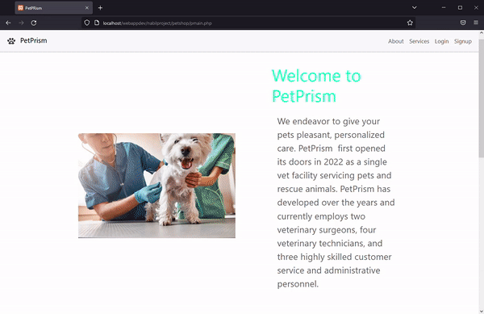
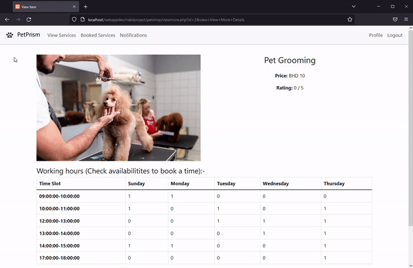
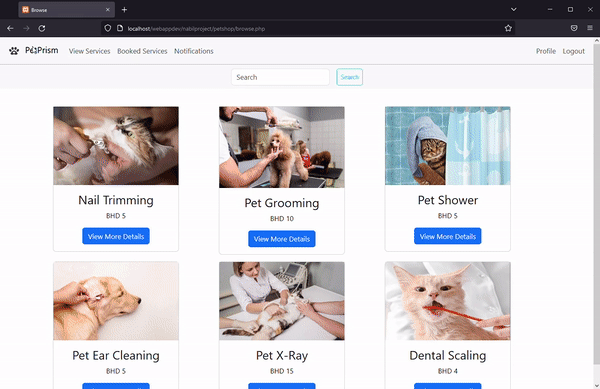
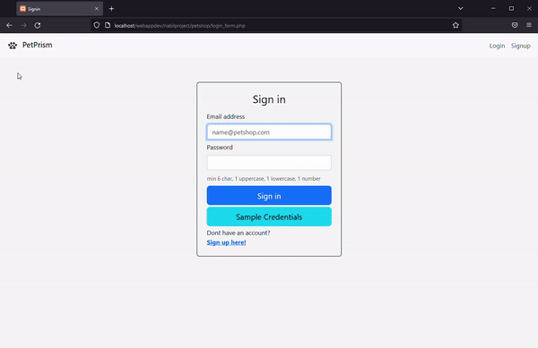

# PetPrism Pet Shop 

  
Online shop portal for a pet shop with access for customer, and admin(shop owner).  
Demo website: [https://petshop.webkraft.space/login_form.php](https://petshop.webkraft.space/login_form.php?fillemail=ahmed@gmail.com&fillpwd=Frankfurt1) 

### Website Functionalities:
1. For customer  
- Customer Login/Register and browse for services  
  

- Check services timings, available time slots and booking a slot  
  

- Rating the received service after it's completed  
  

- Update Profile details and picture  
  

2. For Admin
- Create a new service and remove an existing service  
  
